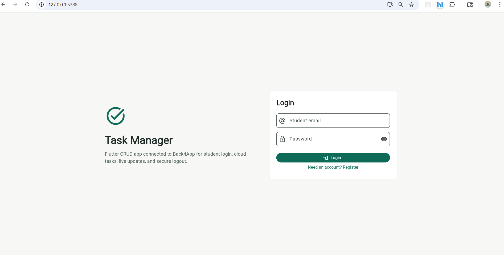
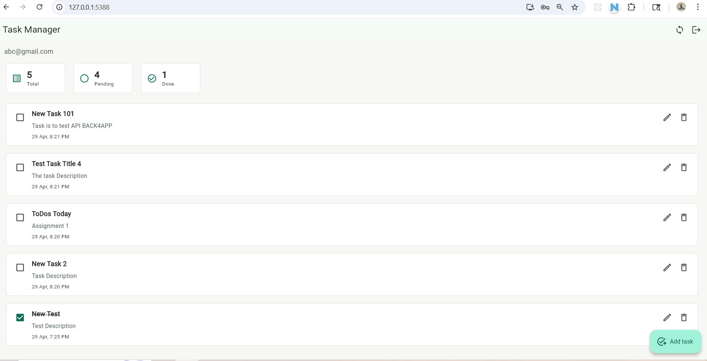
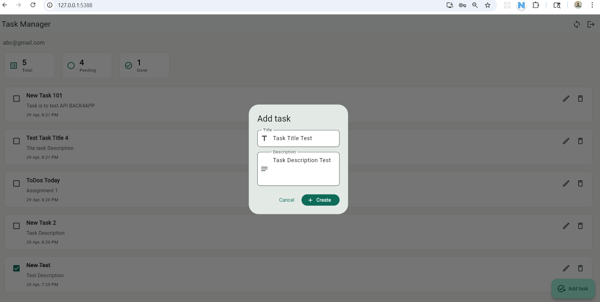
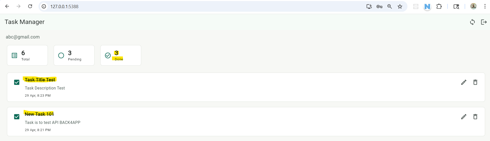

# Task Manager App - Flutter CRUD with Back4App

A Flutter-based Task Manager app that uses Back4App as Backend-as-a-Service (BaaS). The app supports student email registration/login, cloud task CRUD, automatic syncing, and secure logout.

## Project Overview

This assignment implements a Flutter CRUD application with Back4App for:

- User authentication using email and password
- Task creation, display, editing, completion, and deletion
- Cloud database storage on Back4App
- Per-user task ownership and secure access
- Logout with session invalidation

## Video Link: [Drive Link](https://drive.google.com/file/d/1D3n4-ZOQLmiME-2UeJCqrvRfLPcMmqd8/view?usp=sharing)

## Features

- ✅ User registration and login with student email credentials
- ✅ Parse user authentication through Back4App
- ✅ Create, read, update, and delete tasks
- ✅ Mark tasks as done / undone
- ✅ Per-user task ownership using `owner` pointer and ACL
- ✅ Refresh / sync task list automatically
- ✅ Manual pull-to-refresh and sync button
- ✅ Secure logout
- ✅ Responsive Material 3 UI for Flutter

## Technology Stack

- Flutter / Dart
- Back4App Parse Server
- `parse_server_sdk_flutter`
- GitHub for version control
- Local device development

## App Flow

1. User opens the app.
2. User registers with a student email and password or logs in.
3. After authentication, the app loads the user's tasks.
4. User can add a new task with title and description.
5. User can edit or delete existing tasks.
6. User can toggle task completion.
7. User logs out securely.

## Back4App Configuration

The app is already configured to connect with Back4App using the values stored in `lib/main.dart`:

- Server URL: `https://parseapi.back4app.com`

### Task class setup

The app uses a Back4App class named `Task` with the following fields:

- `title` - String
- `description` - String
- `isDone` - Boolean
- `owner` - Pointer to `_User`
- `ACL` - Access control list granting owner read/write access

> Note: Back4App can create the `Task` class automatically when the first task is saved, if client class creation is enabled.

## Running the App

Open a terminal in the project folder and run:

```powershell
flutter pub get
flutter run
```

If you want to run on Chrome:

```powershell
flutter run -d chrome
```

If you want to run on Android:

```powershell
flutter run -d android
```

### Optional Live Query setup

The app supports optional Back4App Live Query if you enable it in Back4App and provide a custom URL.

Run with:

```powershell
flutter run -d chrome --dart-define=PARSE_SERVER_URL=https://your-subdomain.b4a.io --dart-define=PARSE_LIVE_QUERY_URL=wss://your-subdomain.b4a.io
```

## Verification and Testing

Basic widget tests are included in `test/widget_test.dart`.

Run analysis and tests with:

```powershell
flutter analyze
flutter test
```


## Demo Video Checklist

Record a short demo showing:

1. Register a new student email account
2. Log out
3. Log back in
4. Create a task
5. Edit a task
6. Mark a task completed
7. Delete a task
8. Log out again

## Included Files

- `lib/main.dart` — app source code
- `pubspec.yaml` — Flutter dependencies
- `test/widget_test.dart` — widget smoke test
- `README.md` — project documentation
- `docs/Task_Manager_Back4App_Presentation.pptx` — presentation file
- `docs/screenshots/login_screen.png` — login screen screenshot

### Screenshot examples

Login screen:



Task list screen:



Add/Edit task dialog:



Completed task view:



